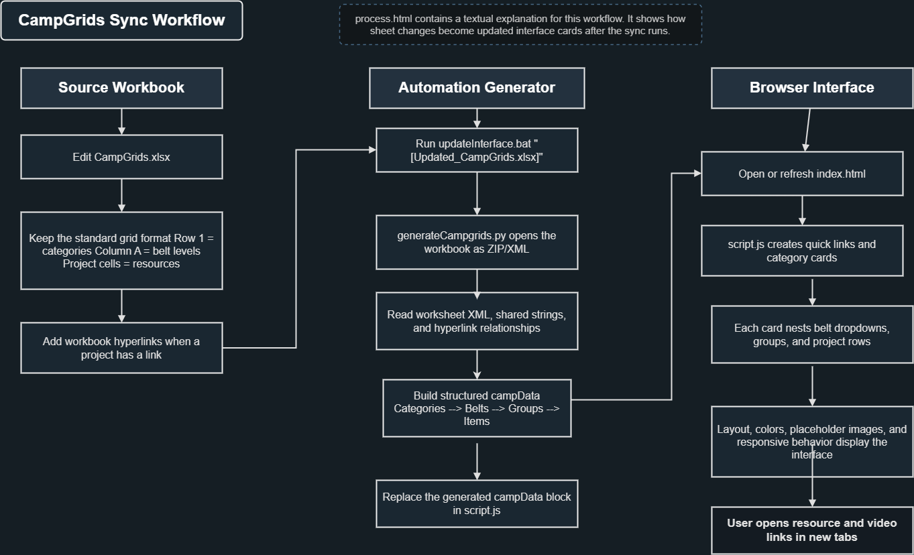
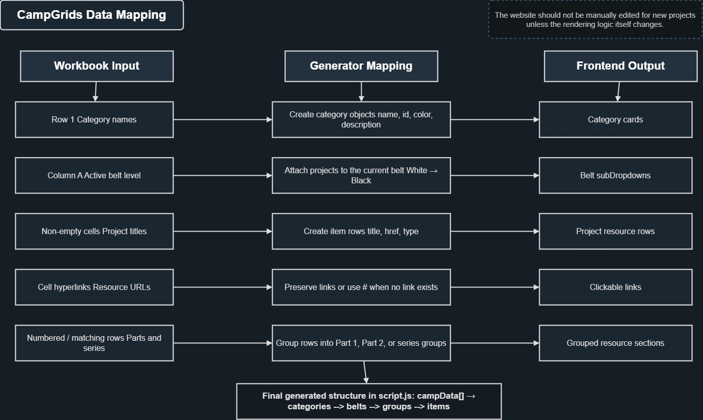
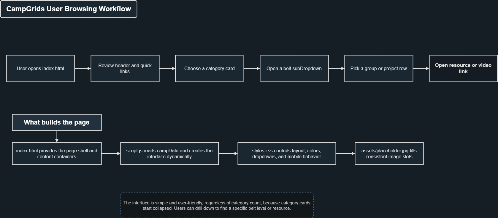

# CampGrids

CampGrids is a static browser for MSI camp grid activities. The idea was proposed by Fannie Yu, an MSI intern, and I built the interface and workbook sync workflow around it.

The site takes what used to live in a large spreadsheet and turns it into a set of category cards, belt sections, and resource/video rows. The goal is simple: make the camp materials easier to scan without losing the structure of the original workbook.

## How It Works

The workbook is still the place where project information should be edited. After the workbook is updated, `updateInterface.bat` sends it into `scripts/generateCampgrids.py`, which rebuilds the generated data inside `script.js`.

The HTML and CSS stay mostly stable. The generated `campData` block is the part that changes when a new workbook is synced.

## Workflow Diagrams

These diagrams show the intended flow of the project. They are the general workflow diagrams for the repo, not the sample screenshots used on the Automation Notes page.

### Main Sync Workflow



### Data Mapping



### User Browsing Workflow



## Main Files

`index.html` contains the page structure and the empty containers that JavaScript fills.

`styles.css` controls the layout, card styling, belt colors, quick links, process page, and placeholder image slots.

`script.js` contains the quick links, generated `campData`, and the rendering logic for cards, belts, sections, and rows.

`process.html` explains the workbook sync process with sample screenshots.

`scripts/generateCampgrids.py` reads a standardized Excel workbook and rebuilds the generated data in `script.js`.

`updateInterface.bat` is the Windows command used to run the sync.

`diagrams/` contains the workflow diagrams used in this README.

`assets/` contains the placeholder image and process-page sample visuals.

## Updating The Site From A Workbook

Run the updater with the workbook path:

```bat
updateInterface.bat "Restored_CampGrids_27-06-26.xlsx"
```

The batch file requires a workbook argument on purpose. That makes it harder to accidentally rebuild the site from the wrong file.

After the command finishes, open or refresh `index.html`.

## Workbook Format

The generator expects the workbook to follow the same basic layout as the source camp grid:

- the first worksheet contains the project grid
- row 1 contains category names
- column A contains belt names
- category columns start at column B
- belt names use `White`, `Yellow`, `Orange`, `Green`, `Blue`, `Purple`, `Brown`, and `Black`
- project cells contain the text shown on the site
- hyperlinks attached to project cells become clickable resource links

## How Rows Become Interface Items

Each non-empty project cell becomes a row in the interface.

Items with `Video` in the title are labeled `video`. Everything else is labeled `resource`, including setup documents such as TinkerCAD setup.

Numbered items such as `1. ...` and `2. ...` become Part 1, Part 2, and similar section headers.

Consecutive related items, such as an instruction row followed by a video row for the same project, become one series section.

Single standalone resources or videos stay as normal rows without an extra section label.

## Adding New Items

Add new projects in the workbook, not directly in the generated `campData` block.

1. Open the latest standardized CampGrids workbook.
2. Add the project under the correct category column.
3. Place it on a row covered by the correct belt in column A.
4. Add a workbook hyperlink if the project has a link.
5. Save the workbook.
6. Run `updateInterface.bat "YourWorkbook.xlsx"`.
7. Refresh `index.html`.

## Interface Notes

Cards start collapsed so the page stays easy to scan.

Belt sections stay color coded.

Part and series labels use lighter rectangular sections so they are visually separate from belt headings.

Quick links use MSI-style outline buttons.

Blank image placeholders are intentional. They reserve space for future visuals without relying on emoji or generated-looking filler.
