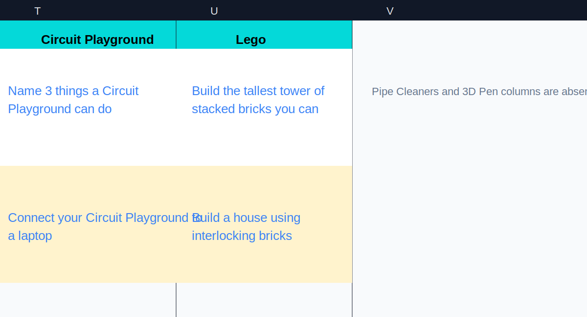
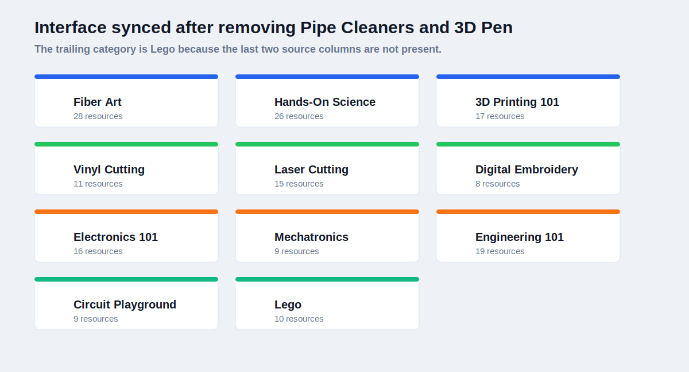
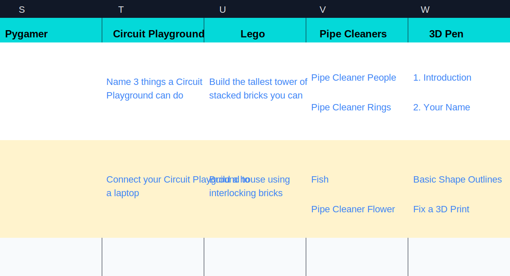
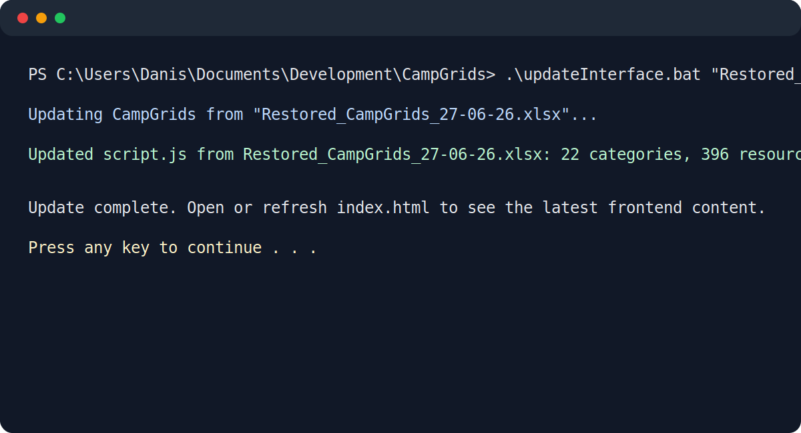
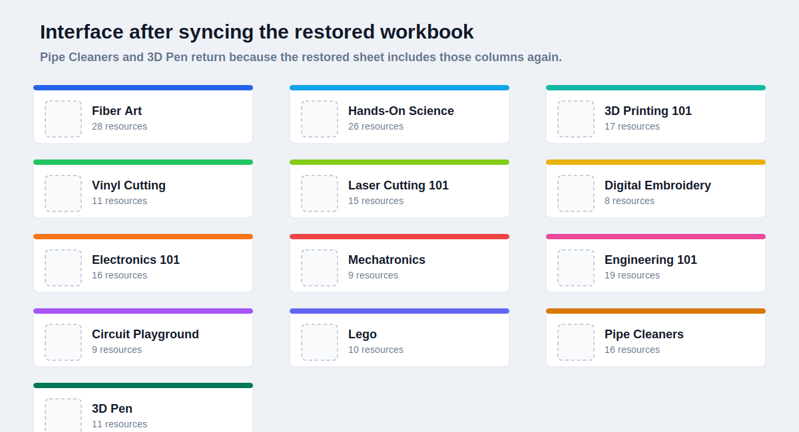

# CampGrids

CampGrids is a static project browser for camp activities. It organizes resources into category cards, belt levels, and project rows so the curriculum is easier to scan than a spreadsheet.

## Files

`index.html` - Page structure and content containers
`process.html` - Automation walkthrough and sync process explanation
`styles.css` - Layout, colors, responsive behavior, and imageSlot styling
`script.js` - Project data, quick links, card rendering, and dropdown behavior
`assets/placeholder.jpg` - Shared image slot graphic
`assets/process/` - Process explanation visuals
`CampGrids.xlsx` - Source workbook
`scripts/generateCampgrids.py` - Workbook-to-site data generator
`updateInterface.bat` - Windows updater for rebuilding `script.js`

## Structure

The page starts with a header, quick links, and a projectCard grid. The card grid is rendered from `campData` in `script.js`.

The `Automation Notes` button below the card grid opens `process.html`, which explains how workbook changes become updated interface cards.

Each category includes:

- a category name
- a short description
- an accent color
- beltLevel subDropdowns
- automatic part/series sections inside each belt
- project rows with titles, links, and resource types

## Visual Sync Walkthrough

The images below show the same test used in `process.html`: remove two category columns from the workbook, sync the interface, restore the columns, and sync again.

### 1. Workbook with columns removed

`Pipe Cleaners` and `3D Pen` are missing from the source workbook, so `Lego` is the last category column available to import.

### 2. Interface after syncing the edited workbook

After the updater reads that workbook, the interface no longer renders the missing categories.

### 3. Workbook with columns restored

The original category columns are added back to the workbook.

### 4. Sync command output

The batch file passes the restored workbook into the generator and reports the rebuilt category/resource totals.

### 5. Interface after syncing the restored workbook

After the restored workbook is synced, the missing categories return to the card grid.

## Data Mapping

The workbook maps into the site like this:

- Row 1, columns B through W become category names.
- Column A provides the active belt level.
- Non-empty cells under each category become project rows.
- Workbook hyperlinks become project links when present.

## Adding New Items

New projects belong in `CampGrids.xlsx`, not directly in the long `campData` block.

To add a new project:

1. Open `CampGrids.xlsx`.
2. Put the project under the correct category column.
3. Put it on a row covered by the correct belt color in column A.
4. Add the project link as a workbook hyperlink when one exists.
5. Save the workbook.
6. Run `updateInterface.bat`.
7. Open or refresh `index.html`.

The updater reads the workbook and rebuilds the category cards, belt sections, project rows, counts, and comments in `script.js`.

## Standard Workbook Format

The updater expects this structure:

- The first worksheet contains the project grid.
- Row 1 contains category names.
- Column A contains belt names.
- Category columns start at column B.
- Belt names use: White, Yellow, Orange, Green, Blue, Purple, Brown, Black.
- Project cells contain the text shown on the site.
- Hyperlinks attached to project cells become clickable project links.

As long as a replacement workbook keeps that format, running `updateInterface.bat "YourWorkbook.xlsx"` rebuilds the site data automatically.

## Design Notes

- Cards stay collapsed by default to keep the page easy to scan.
- Belt colors appear as compact subDropdown buttons inside each category.
- Numbered resources become Part 1, Part 2, and similar sections automatically.
- Consecutive matching instruction/video rows become series sections automatically.
- Single standalone resources/videos stay as normal rows without an extra section label.
- Image slots reserve consistent visual space across headers, cards, and rows.
- Links open in new tabs so the main grid stays available.
