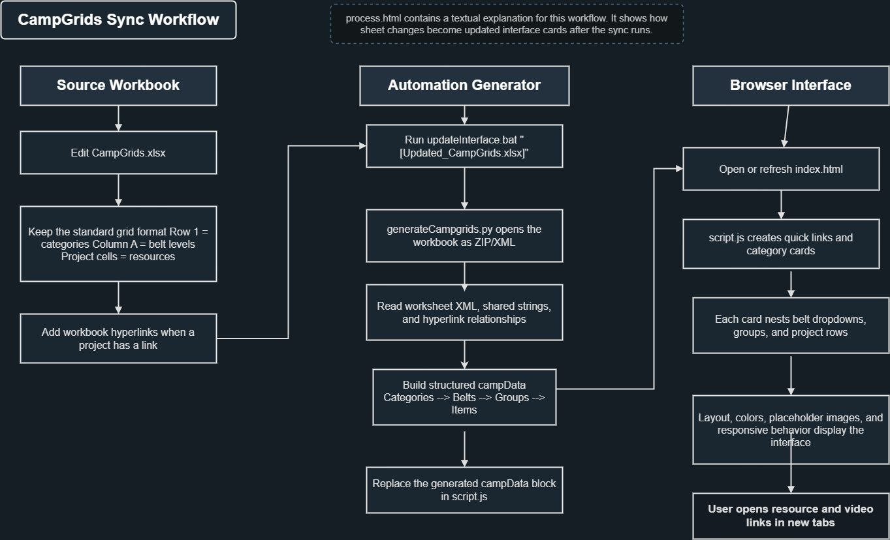
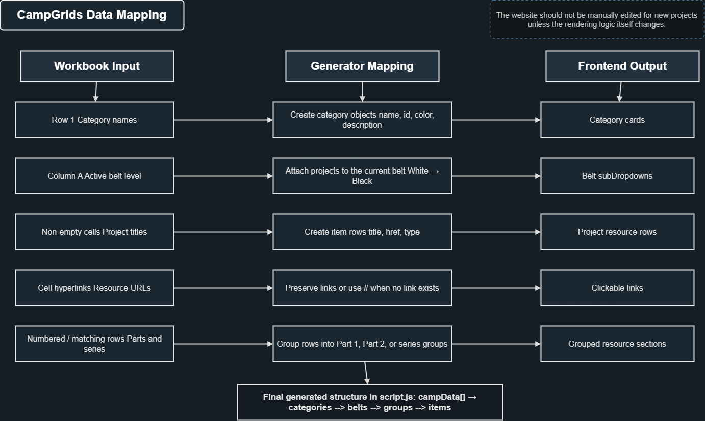
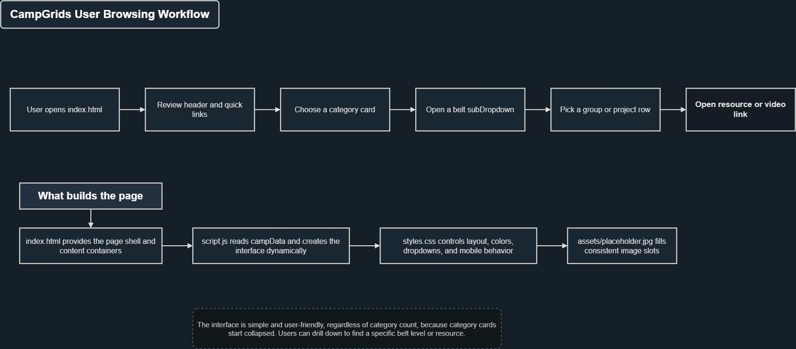

# CampGrids

CampGrids is a static browser for MSI camp grid activities. The idea was proposed by [Fannie Yu](https://www.linkedin.com/in/fannieyu/), an MSI intern, and I ([Danish Nadar](https://www.linkedin.com/in/danish-nadar/)) built the interface and workbook sync workflow around it.

The site takes what used to live in a large spreadsheet and turns it into a set of category cards, belt sections, and resource/video rows. The intention was to make the camp materials easier to scan without losing the structure of the original workbook.

## Accounts, classes, and MSI administration

CampGrids now includes a Supabase-backed application layer alongside the public Grid:

- `auth.html` provides student, teacher, and MSI staff sign-in. Student usernames are assigned atomically as first-initial + last-name (`dnadar`, `dnadar1`, `dnadar2`…), while teachers can use their email or username.
- `dashboard.html` gives teachers unique class codes, CSV roster imports that provision student accounts, per-class completion and belt KPIs, progress reviews, belt awards, credential exports, class CSV exports, and printable Grid assignment sheets.
- Student activity—sign-in, Grid resource/video opens, assignment completion, and belt awards—is recorded in the student profile timeline.
- MSI admins can create published pages, add them to the live navigation, and maintain dropdown options from their dashboard. Those controls update connected browsers live when Supabase Realtime is enabled.

The complete Supabase schema, RLS access rules, and secure roster-provisioning Edge Function are in [`supabase/`](supabase/README.md). Copy `supabase-config.example.js` to `supabase-config.js`, add your project URL and anon key, run the SQL migration, and deploy the function before using the account tools.

## How It Works

The workbook is still the place where project information should be edited. After the workbook is updated, `updateInterface.bat` sends it into `scripts/generateCampgrids.py`, which rebuilds the generated data inside `script.js`.

The HTML and CSS stay mostly stable. The generated `campData` block is the part that changes when a new workbook is synced.

## Workflow Diagrams

These diagrams show the intended flow of the project. They are the general workflow diagrams for the repo, not the sample screenshots used on the Automation Notes page.

### Main Sync Workflow



### Data Mapping



### User Browsing Workflow



## Main Files

`index.html` is the homepage. It welcomes visitors and lists every camp as a full-width row.

`campgrids.html` is the Activities page, the core of the site. It contains the empty containers that `script.js` fills with the category cards.

`camp.html` is the shared template for every camp page. The camp id in the address, such as `camp.html?camp=mini-makers`, decides which camp is shown.

`gallery.html` is the shared template for the photo gallery pages. It takes a camp id and an optional themed week id, such as `gallery.html?camp=mini-makers&week=circuit-benders`.

`about.html` explains what the site is and how its parts fit together.

`site.js` holds the navigation bar, the external link list, the camp lists, and the rendering for the homepage camp rows, the camp pages, and the gallery pages. Each camp has a `kind`: `themed` camps show Themed Activity Weeks, `grid` camps show The Camp Grids section, and `info` camps show neither. Each camp menu in the navigation bar opens a full-width dropdown with the camp links on the left and a featured block on the right; the featured photo, wording, and button link come from `navFeaturePlaceholder` near the top of the file and are placeholders until real content is supplied.

`styles.css` controls the layout, card styling, belt colors, quick links, process page, and placeholder image slots. The brand color lives in the `--accent` and `--accentStrong` variables at the top of the file, so changing the site's color means editing those two lines. Belt colors are deliberately separate, because a belt's color is its name rather than a design choice.

`script.js` contains the generated `campData` and the rendering logic for cards, belts, sections, and rows on `campgrids.html`.

`process.html` explains the workbook sync process with sample screenshots.

`scripts/generateCampgrids.py` reads a standardized Excel workbook and rebuilds the generated data in `script.js`.

`updateInterface.bat` is the Windows command used to run the sync.

`diagrams/` contains the workflow diagrams used in this README.

`assets/` contains the site images, the fallback placeholder, and the process-page sample visuals.

## Updating The Site From A Workbook

Run the updater with the workbook path:

```bat
updateInterface.bat "Restored_CampGrids_27-06-26.xlsx"
```

The batch file requires a workbook argument on purpose. That makes it harder to accidentally rebuild the site from the wrong file.

After the command finishes, open or refresh `campgrids.html`.

## Image Naming

Images are loaded during the same sync process as the workbook data. The site does not search the folder in the browser. Instead, `generateCampgrids.py` scans the `assets/` folder, matches standardized filenames, and writes the matching image paths into `script.js`.

Put new images directly inside `assets/`. Do not put these matched card/resource images inside `assets/process/`; that folder is only for the Automation Notes screenshots.

The supported image types are `.png`, `.jpg`, `.jpeg`, `.webp`, `.gif`, and `.svg`.

### Category cover images

Use this pattern for the main image on a category card:

```text
CategoryName_Cover.png
```

Examples already in the project:

```text
Notebooking_Cover.png
OrigamiFigure_Cover.png
PaperFlight_Cover.png
```

The matching is forgiving about spaces and punctuation. For example, the workbook category `Origami (Figure)` can match `OrigamiFigure_Cover.png`.

### Belt/resource images

Use this pattern for images that should show on resource rows for a category and belt:

```text
CategoryName_BeltCode.png
```

Examples already in the project:

```text
Notebooking_WT.png
Notebooking_YW.png
Notebooking_OR.png
```

If one belt has multiple separate projects and each project needs its own image, add another underscore and the project name:

```text
CategoryName_BeltCode_ProjectName.png
```

Example:

```text
OrigamiFigure_BU_TraditionalCrane.png
OrigamiFigure_BU_FlappingBird.png
```

That extra project name matters for sections like Origami Figure Blue Belt, where Traditional Crane and Flapping Bird should not share the same image.

Video rows intentionally do not show image placeholders or matched images; only resource rows use these item images.

Current belt codes:

- `WT` for White
- `YW` for Yellow
- `OR` for Orange
- `GR` for Green
- `BU` for Blue
- `PU` for Purple
- `BN` for Brown
- `BK` for Black

The script also accepts a few backup versions of those codes, but the list above is the clean standard to use.

### Background image

The large header background is handled by CSS, not the workbook generator:

```text
assets/CampGrids_TitleBG.png
```

If that image is replaced with a new file using the same name, the header will use the new image automatically after refresh.

### Getting new images to show up

1. Add the image files to `assets/`.
2. Make sure the filenames follow the naming rules above.
3. Run `updateInterface.bat "YourWorkbook.xlsx"`.
4. Refresh `campgrids.html`.

If an image does not match a category or belt code, the site keeps using `assets/placeholder.jpg` for that spot. That fallback is intentional, so missing images do not break the page.

## Workbook Format

The generator expects the workbook to follow the same basic layout as the source camp grid:

- the first worksheet contains the project grid
- row 1 contains category names
- column A contains belt names
- category columns start at column B
- belt names use `White`, `Yellow`, `Orange`, `Green`, `Blue`, `Purple`, `Brown`, and `Black`
- project cells contain the text shown on the site
- hyperlinks attached to project cells become clickable resource links

## How Rows Become Interface Items

Each non-empty project cell becomes a row in the interface.

Items with `Video` in the title are labeled `video`. Everything else is labeled `resource`, including setup documents such as TinkerCAD setup.

Numbered items such as `1. ...` and `2. ...` become Part 1, Part 2, and similar section headers.

Consecutive related items, such as an instruction row followed by a video row for the same project, become one section with a shared heading.

Single standalone resources or videos also get their own one-item section heading so the belt contents stay visually consistent.

## Adding New Items

Add new projects in the workbook, not directly in the generated `campData` block.

1. Open the latest standardized CampGrids workbook.
2. Add the project under the correct category column.
3. Place it on a row covered by the correct belt in column A.
4. Add a workbook hyperlink if the project has a link.
5. Save the workbook.
6. Run `updateInterface.bat "YourWorkbook.xlsx"`.
7. Refresh `campgrids.html`.

## Interface Notes

Cards start collapsed so the page stays easy to scan.

Belt sections stay color coded.

Part and series labels use lighter rectangular sections so they are visually separate from belt headings.

Quick links use MSI-style outline buttons.

Blank image placeholders are intentional. They reserve space anywhere a matching standardized image has not been added yet.
